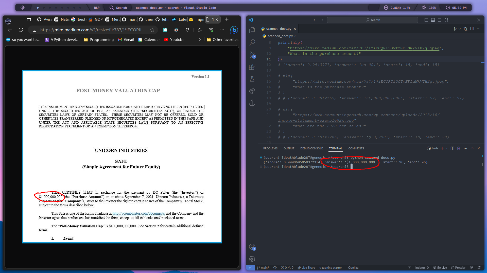
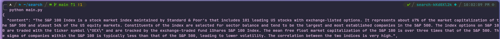
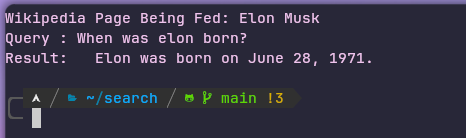
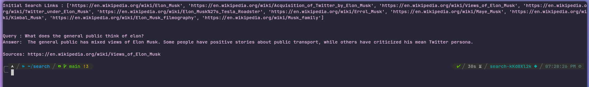
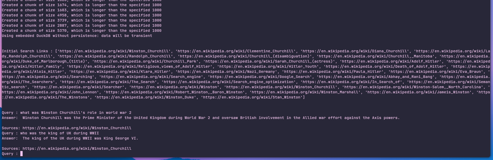
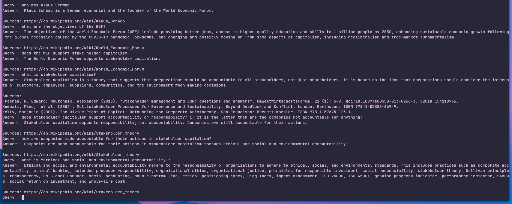
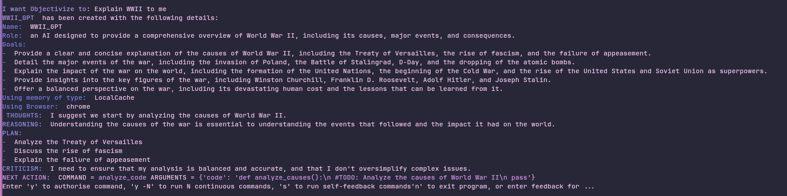

# Objectivize
Autonomous LLM for deducing conclusions using objective facts.

## To-Do's
 - Filter through search results and approve content of specific sites only
 - Add a default "objective fact" keyword in the prompts
 
 ## Installation Instruction
 ```bash
 git clone https://github.com/AviralDhingra/Objectivize.git
 cd Objectivize
 
 # Linux
 ./run.sh
 
 # Windows
 ./run.bat
 ```

## Screenshots









